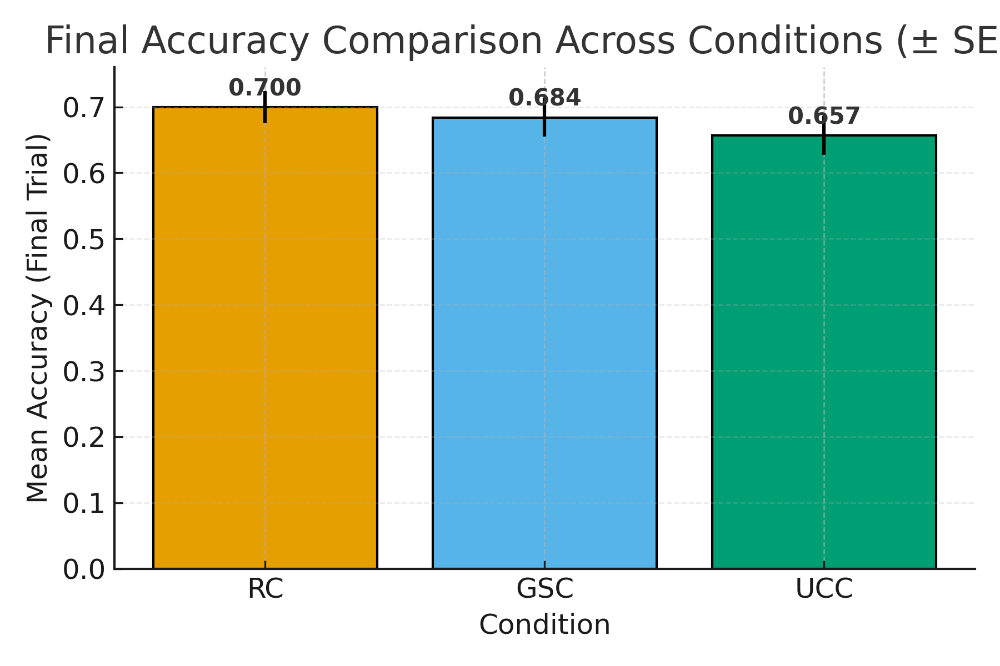

# ML Strategies for Prosthetic Arm Control

## Introduction

This project investigates how different machine learning training strategies can improve gesture recognition accuracy and enhance users' understanding of ML systems for prosthetic arm control. The system uses electromyographic (EMG) signals from the Myo armband to classify hand gestures and movements, enabling intuitive control of prosthetic devices.

The core research question addresses whether the order and method of presenting gesture classes during training impacts both model performance and user learning. We compare three distinct curriculum strategies: a random baseline, a user-driven approach, and an adaptive system-driven approach based on gesture separability in the classifier space.

## Methodology

The experiment evaluates three learning strategies:

1. **Random Curriculum (RC)** - The system cues gesture classes randomly (control)
2. **User Choice Curriculum (UCC)** - The user selects gesture classes to practice 
3. **Gesture Separability Curriculum (GSC)** - The system queries gesture classes based on their separability in classifier space

## Metrics

1. **Learning analytics** - 
   (i) Evolution of classification accuracy over 120 trials
   <!-- (ii) Delta accuracy: final accuracy − initial accuracy per user and per strategy -->
   (ii) Learning rate per strategy: Learning curves often follow a power-law.
   Linear regression on learning data transforms the learning function into a straight line, which can be analyzed. 
   The slope gives the learning rate, a steeper positive slope → faster improvement in performance.
2. **User understanding / mental model** - Performance on post-training functional tests.    Reflects how well users understand how the prosthesis interprets their movements.

### Technical Implementation

The system uses:
- **Myo Armband** for EMG signal acquisition
- **Machine Learning Classifier**: Linear Discriminant Analysis (LDA)
- **Feature Extraction**: Time-domain features from EMG signals (RMS)
- **Real-time Classification**: WebSocket-based communication between Python backend and JavaScript frontend

### Gesture Classes

The system recognizes the following gestures:
- Wrist Pronation
- Wrist Supination
- Hand Closing
- Hand Opening
- Pinch Closing
- Pinch Opening
- Rest
- Index Point

## Results

<!-- ### Model Accuracy

 -->

### Evolution of classification accuracy

<!-- ### Delta Accuracy

 -->

### Learning Rates

### Functional/Test accuracy after training

## Conclusion
Our study demonstrates that the adaptive system-driven strategy (Gesture Separability Condition), which selects gesture classes to maximize separability, yielded the fastest and largest improvement in model accuracy compared to random and user-driven (User Choice Condition) training.
All strategies enhanced gesture separability, but the adaptive system-driven condition produced the greatest gains, indicating better motor consistency and more structured learning.
Participants trained under the adaptive system-driven strategy also developed a more accurate and realistic mental model of the prosthesis, improving their ability to predict and interpret the model’s behavior. 

Reference : Sungeelee, V., Jarrassé, N., Sanchez, T., & Caramiaux, B. (2024, March). Comparing teaching strategies of a machine learning-based prosthetic arm. In Proceedings of the 29th International Conference on Intelligent User Interfaces (pp. 715-730).

## Running the Code

### Prerequisites

- Myo-Python is required
- Node.js and npm
- Python 3.x

### Setup Instructions

1. Command to launch Marcelle app: `npm run dev`
2. Command to launch Marcelle backend: `npm run backend`
3. Run Python server: `python server.py`
4. Starting page is called `start.html`, choose a user training strategy and click on 'Go to Page' button

### Development Mode

**npm run dev**

Runs the app in the development mode.
Open http://127.0.0.1:5173/ to view it in the browser.
